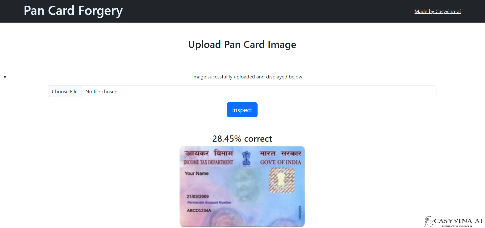

# Pan_Card_Forgery_Detection

PAN cards are an important form of identification in Nigeria. However, there is a growing problem of fake PAN cards being used for fraudulent purposes. This project aims to use computer vision to identify fake PAN cards.

## Table of Contents

- [Project Overview](#project-overview)
- [Benefits](#benefits)
- [Installation](#installation)
- [Usage](#usage)
- [Conclusion](#conclusion)
- [Contributing](#contributing)
- [License](#license)

## Project Overview

This project will develop a system that can compare an uploaded PAN card to a database of original PAN cards to identify any tampering or fraud. The system will use a computer vision technique called structural similarity index (SSIM) to compare the two images. SSIM is a measure of how similar two images are in terms of their structure, or how they are arranged. If the SSIM score is high, then the two images are very similar. If the SSIM score is low, then the two images are very different.

The system will be trained on a dataset of original and fake PAN cards. Once trained, the system will be able to identify fake PAN cards with a high degree of accuracy.

## Benefits

This project will have a number of benefits, including:

Helping organizations verify the authenticity of PAN cards provided by employees, customers, or anyone else.
Reducing the risk of PAN card fraud.
Improving the security of PAN cards.

## Installation

Step to run application:
Step 1:	Create the copy of the project.
Step 2: Open command prompt and change your current path 
to folder where you can find 'app.py' file.
Step 3: Create environment by command given below-
conda create -name <environment name>
Step 4: Activate environment by command as follows-
conda activate <environment name>
Step 5: Use command below to install required dependencies-
python -m pip install -r requirements.txt
Step 6: Run application by command;
python app.py
You will get url copy it and paste in browser.
Step 7: You have sample_data folder where you can get images to test.

## Usage
Update directory in the original folder to company original pan card template sample. 
Use the template sample to verify pan card submitted by personels for verification.

## Conclusion

This project has the potential to make a significant contribution to the fight against PAN card fraud. By using computer vision to identify fake PAN cards, the project can help organizations protect themselves from fraud and improve the security of PAN cards for everyone.

## Contributing

Contributions are welcome! Feel free to open issues or pull requests for suggestions, bug reports, or improvements.

## License

This project is licensed under the [MIT License](LICENSE).
